Group Project 1
================
14 Sep 2024

Hello! This is a tutorial meant to help you do some basic data analysis
and make graphs using R Studio. We assume that you’ve already had R
installed and updated and you may have had some experience in the past
with coding in R. If not, there are many resources online to get you up
to speed!

We’ll be giving a lot of examples from a dataset of bee colony loss
across the United States, a recent and pressing ecological and
agricultural problem. We’ve also included some areas for you to put your
own understanding into practice and try to write your own code.

There are a couple of objectives for you to follow along with in this
assignment:

1.  To be able to explore data within a dataset based on the data type
    to be able to convert variables into different type to be able to
    identify outliers, messy data, or non-normal distributions to be
    able to log transform the variables to visualize them better

2.  To use filter to create a subset of a variable appropriate to your
    analysis question

3.  To create appropriate and clear graphs to visualize data in both
    categorical and numeric variables represented in the hypothesis
    using ggplot2 to be able to create a scatterplot and box and whisker
    plot to be able to edit labels and change the style to fit their
    preferences to able to interpret the plot

4.  To use an anova and linear model to help us interpret variables in
    our provided hypothesis to be able to create a linear model to be
    able to do follow up anova and tukey tests to be able to interpret
    the results from these tests

## Loading the packages

First of all, you’ll need to load all the packages that might be
required for the project that will allow you to use certain functions.

## Importing the dataset

You’ll need to load the dataset using the read_csv or read.csv function.
For this project, we directly imported the dataset from Tidytuesday in
Github. For other projects, you might want to download the .xls file or
other file types and then import it in the R. However, you’ll have to
make sure that your .Rmd project file and the data file is in the same
folder or directory in R studio, else the codes will not run.

``` r
colony <- readr::read_csv('https://raw.githubusercontent.com/rfordatascience/tidytuesday/master/data/2022/2022-01-11/colony.csv', show_col_types = FALSE)
```

## Colony dataset

The bee colony dataset comes from the USDA (US Department of
Agriculture).

### Description of the bee colony data

Every year a significant number of bee colonies are being lost from each
of the states in the US. Alarm over honeybee numbers began growing since
2006, when a phenomenon called “Colony collapse disorder” became widely
known. This problem, in which the majority of worker bees abandon the
colony, has since receded but beekeepers are now faced with more general
die-offs linked to disease, pesticide use and habitat loss. Since the
higher losses has been noticed, agricultural agencies, researchers, and
the beekeeping industry have been working together to understand why and
develop best management practices to reduce their losses. A survey is
done annually to highlight the continuing high rates of honey bee colony
loss in each of the states.

This dataset provides information on honey bee colonies in terms of
number of colonies (colony_n), maximum (colony_max),lost (colony_lost),
percent lost (colony_lost_pct), added (colony_added), renovated
(colony_reno), and percent renovated (colony_reno_pct), as well as
colonies lost with Colony Collapse Disorder symptoms with both over and
less than five colonies.

We chose this dataset because: 1. It is a large dataset, so it can be
beneficial to make many hypothesis and visualize and analyze the
information regarding hone bee colonies and their losses. 2. No
background knowledge/information is required to understand the dataset;
it’s simple and easy to understand just by reading the description
provided above (and looking at our variables). 3. It contains both
categorical and numerical variables such that we can different graphs
and perform different statistical tests accordingly.

## Data Exploration

You’ll need to use the str() function to check out the structure of the
dataset. It will tell you about the different variables, their data
type, and the number of observations from each of the variables.

Before you proceed with analyzing the dataset, it is necessary to make
sure that it is complete and that you understand what each variable
(column) means. Most of the times, You may need to refer to the paper
where it is imported from.

You’ll need to look at each variable (column) and determine if it is in
the correct data type. The str() function shows the data types of
different variables considered by R, while the summary will show what
information the variables actually contain.

Some of the variables might need conversion to a different data type.

``` r
str(colony)
```

    ## spc_tbl_ [1,222 × 10] (S3: spec_tbl_df/tbl_df/tbl/data.frame)
    ##  $ year           : num [1:1222] 2015 2015 2015 2015 2015 ...
    ##  $ months         : chr [1:1222] "January-March" "January-March" "January-March" "January-March" ...
    ##  $ state          : chr [1:1222] "Alabama" "Arizona" "Arkansas" "California" ...
    ##  $ colony_n       : num [1:1222] 7000 35000 13000 1440000 3500 3900 305000 104000 10500 81000 ...
    ##  $ colony_max     : num [1:1222] 7000 35000 14000 1690000 12500 3900 315000 105000 10500 88000 ...
    ##  $ colony_lost    : num [1:1222] 1800 4600 1500 255000 1500 870 42000 14500 380 3700 ...
    ##  $ colony_lost_pct: num [1:1222] 26 13 11 15 12 22 13 14 4 4 ...
    ##  $ colony_added   : num [1:1222] 2800 3400 1200 250000 200 290 54000 47000 3400 2600 ...
    ##  $ colony_reno    : num [1:1222] 250 2100 90 124000 140 NA 25000 9500 760 8000 ...
    ##  $ colony_reno_pct: num [1:1222] 4 6 1 7 1 NA 8 9 7 9 ...
    ##  - attr(*, "spec")=
    ##   .. cols(
    ##   ..   year = col_double(),
    ##   ..   months = col_character(),
    ##   ..   state = col_character(),
    ##   ..   colony_n = col_double(),
    ##   ..   colony_max = col_double(),
    ##   ..   colony_lost = col_double(),
    ##   ..   colony_lost_pct = col_double(),
    ##   ..   colony_added = col_double(),
    ##   ..   colony_reno = col_double(),
    ##   ..   colony_reno_pct = col_double()
    ##   .. )
    ##  - attr(*, "problems")=<externalptr>

``` r
summary(colony)
```

    ##       year         months             state              colony_n      
    ##  Min.   :2015   Length:1222        Length:1222        Min.   :   1300  
    ##  1st Qu.:2016   Class :character   Class :character   1st Qu.:   8000  
    ##  Median :2018   Mode  :character   Mode  :character   Median :  17500  
    ##  Mean   :2018                                         Mean   : 123578  
    ##  3rd Qu.:2019                                         3rd Qu.:  55500  
    ##  Max.   :2021                                         Max.   :3181180  
    ##                                                       NA's   :47       
    ##    colony_max       colony_lost     colony_lost_pct  colony_added   
    ##  Min.   :   1700   Min.   :    20   Min.   : 1.00   Min.   :    10  
    ##  1st Qu.:   9000   1st Qu.:   950   1st Qu.: 6.00   1st Qu.:   420  
    ##  Median :  21000   Median :  2200   Median :10.00   Median :  1800  
    ##  Mean   :  79113   Mean   : 16551   Mean   :11.38   Mean   : 17243  
    ##  3rd Qu.:  68750   3rd Qu.:  6500   3rd Qu.:15.00   3rd Qu.:  6500  
    ##  Max.   :1710000   Max.   :502350   Max.   :52.00   Max.   :736920  
    ##  NA's   :72        NA's   :47       NA's   :54      NA's   :83      
    ##   colony_reno     colony_reno_pct 
    ##  Min.   :    10   Min.   : 1.000  
    ##  1st Qu.:   260   1st Qu.: 2.000  
    ##  Median :   960   Median : 6.000  
    ##  Mean   : 15279   Mean   : 9.098  
    ##  3rd Qu.:  4585   3rd Qu.:12.000  
    ##  Max.   :806170   Max.   :77.000  
    ##  NA's   :131      NA's   :260

In this case, R has considered “year” as numeric data type (num), and
“months” and “sate’ as character (chr). Since all of them are
categorical variables as shown by the summary, they need to be converted
as factors using the as.factor() function.

In cases, where the data needed to be converted to a different data type
other than factor, for example into character, then we could use the
as.character() function. It works similarly for converting other data
types.

### Conversion of the data type of variables

``` r
colony$year <- as.factor(colony$year)
colony$months <- as.factor(colony$months)
colony$state <- as.factor(colony$state)

str(colony)
```

    ## spc_tbl_ [1,222 × 10] (S3: spec_tbl_df/tbl_df/tbl/data.frame)
    ##  $ year           : Factor w/ 7 levels "2015","2016",..: 1 1 1 1 1 1 1 1 1 1 ...
    ##  $ months         : Factor w/ 4 levels "April-June","January-March",..: 2 2 2 2 2 2 2 2 2 2 ...
    ##  $ state          : Factor w/ 47 levels "Alabama","Arizona",..: 1 2 3 4 5 6 7 8 9 10 ...
    ##  $ colony_n       : num [1:1222] 7000 35000 13000 1440000 3500 3900 305000 104000 10500 81000 ...
    ##  $ colony_max     : num [1:1222] 7000 35000 14000 1690000 12500 3900 315000 105000 10500 88000 ...
    ##  $ colony_lost    : num [1:1222] 1800 4600 1500 255000 1500 870 42000 14500 380 3700 ...
    ##  $ colony_lost_pct: num [1:1222] 26 13 11 15 12 22 13 14 4 4 ...
    ##  $ colony_added   : num [1:1222] 2800 3400 1200 250000 200 290 54000 47000 3400 2600 ...
    ##  $ colony_reno    : num [1:1222] 250 2100 90 124000 140 NA 25000 9500 760 8000 ...
    ##  $ colony_reno_pct: num [1:1222] 4 6 1 7 1 NA 8 9 7 9 ...
    ##  - attr(*, "spec")=
    ##   .. cols(
    ##   ..   year = col_double(),
    ##   ..   months = col_character(),
    ##   ..   state = col_character(),
    ##   ..   colony_n = col_double(),
    ##   ..   colony_max = col_double(),
    ##   ..   colony_lost = col_double(),
    ##   ..   colony_lost_pct = col_double(),
    ##   ..   colony_added = col_double(),
    ##   ..   colony_reno = col_double(),
    ##   ..   colony_reno_pct = col_double()
    ##   .. )
    ##  - attr(*, "problems")=<externalptr>

We check the structure of the dataset again to confirm that the
transformation has worked.

``` r
head(colony)
```

    ## # A tibble: 6 × 10
    ##   year  months        state      colony_n colony_max colony_lost colony_lost_pct
    ##   <fct> <fct>         <fct>         <dbl>      <dbl>       <dbl>           <dbl>
    ## 1 2015  January-March Alabama        7000       7000        1800              26
    ## 2 2015  January-March Arizona       35000      35000        4600              13
    ## 3 2015  January-March Arkansas      13000      14000        1500              11
    ## 4 2015  January-March California  1440000    1690000      255000              15
    ## 5 2015  January-March Colorado       3500      12500        1500              12
    ## 6 2015  January-March Connectic…     3900       3900         870              22
    ## # ℹ 3 more variables: colony_added <dbl>, colony_reno <dbl>,
    ## #   colony_reno_pct <dbl>

``` r
tail(colony)
```

    ## # A tibble: 6 × 10
    ##   year  months     state         colony_n colony_max colony_lost colony_lost_pct
    ##   <fct> <fct>      <fct>            <dbl>      <dbl>       <dbl>           <dbl>
    ## 1 2021  April-June Washington       66000     122000        2900               2
    ## 2 2021  April-June West Virginia     8000       9000         170               2
    ## 3 2021  April-June Wisconsin        42000      57000        2200               4
    ## 4 2021  April-June Wyoming          13500      30000        3400              11
    ## 5 2021  April-June Other States      5970       8410         140               2
    ## 6 2021  April-June United States  2855070         NA      255860               9
    ## # ℹ 3 more variables: colony_added <dbl>, colony_reno <dbl>,
    ## #   colony_reno_pct <dbl>

Using the head() and tail() functions show you the top 6 and bottom 6
observations of your dataset. This is a good way to know if the
observations for each of the variables are arranged in order. Because
sometimes, you might want to rearrange the order of the levels of the
variables for easier analysis.

In this case, the observations seem to have been arranged in
chronological manner. For example, the observations for the column
“year” starts with 2015 and ends with 2021. It means that there mus be
observations of year 2016 to 2020 in an ascending order between 2015 and
2021. Similarly, the “state” variable is arranged in an alphabetically
order.

Overall, it looks like for for each states in the US, the bee colony
data has been recorded each year from 2015 to 2021 for each month range
(Jan-Mar, Apr-June, July-Sept, Oct-Dec).

This kind of arrangement can be pretty beneficial in most cases.

``` r
nrow(colony)
```

    ## [1] 1222

``` r
ncol(colony)
```

    ## [1] 10

Checking the number of rows and columns is just another way to check the
number of observations you have (you can see them in the structure too.)

## Creating a clean dataset

Clean dataset refers to creating a new dataset by removing rows or
columns that might not be required for data analysis.

We will only remove the NA’s (missing values) for now. It is often
necessary do so because they can interfere with data analysis, but
honestly, it depends on the context.

For example: Removing the NA’s will make sure that the statistical
functions run smoothly, it will avoid incorrect results for certain
models, like regression, which requires the missing data to be well
handled. This might lead to more reliable interpretations. But at the
same time, deleting rows with NA will reduce the sample size which might
causing the analysis to lose statistical power. In cases where NA’s are
not random, removing them might bias the results, especially if missing
data is systematically related to certain variables.

Here we are using the pipe function, or \|\> . This is neat trick that
can be used with some r commands (not all of them unfortunately) to
basically say, “use the output of this line as the input of the next
line”.

``` r
clean_colony <- colony |> 
  drop_na(colony_n:colony_reno_pct) # the : sign is used to select the all the columns from colony_n to the last column colony_reno_pct. Only use that sign if you want to drop NA's of all the columns existing between them.
```

The drop_na() function removes rows where any column contains NA’s. In
this dataset, there were no NA’s in the first three columns, so we
assigned the function to the remaining columns. It can also be modified
by choosing specific columns depending on your hypothesis.

``` r
summary(clean_colony)
```

    ##    year                  months               state        colony_n      
    ##  2015:153   April-June      :273   California    : 25   Min.   :   1600  
    ##  2016:124   January-March   :216   Florida       : 25   1st Qu.:   8000  
    ##  2017:157   July-September  :265   Oregon        : 25   Median :  17500  
    ##  2018:157   October-December:175   Georgia       : 24   Mean   :  70448  
    ##  2019:108                          Ohio          : 24   3rd Qu.:  57000  
    ##  2020:152                          South Carolina: 24   Max.   :1440000  
    ##  2021: 78                          (Other)       :782                    
    ##    colony_max       colony_lost     colony_lost_pct  colony_added   
    ##  Min.   :   1900   Min.   :    30   Min.   : 1.00   Min.   :    10  
    ##  1st Qu.:   9500   1st Qu.:  1000   1st Qu.: 7.00   1st Qu.:   570  
    ##  Median :  22000   Median :  2200   Median :10.00   Median :  2100  
    ##  Mean   :  88477   Mean   :  9646   Mean   :11.46   Mean   : 10329  
    ##  3rd Qu.:  78000   3rd Qu.:  7000   3rd Qu.:15.00   3rd Qu.:  7500  
    ##  Max.   :1710000   Max.   :255000   Max.   :48.00   Max.   :250000  
    ##                                                                     
    ##   colony_reno     colony_reno_pct 
    ##  Min.   :    20   Min.   : 1.000  
    ##  1st Qu.:   420   1st Qu.: 2.000  
    ##  Median :  1300   Median : 6.000  
    ##  Mean   :  8952   Mean   : 9.075  
    ##  3rd Qu.:  5000   3rd Qu.:12.000  
    ##  Max.   :285000   Max.   :77.000  
    ## 

We can see that after removing NA’s, the number of observations
decreased from 1222 to 929.

\#Filtering Data

Besides dropping NA’s, using the filter function can be another strategy
to create clean datasets and eliminate irrelevant information.

After all of that complicated and scary data exploration, you might
still have questions about the data set. filter() is a great code you
can use to filter out the data to create a subset of variables
appropriate to analyze your remaining questions.

Let’s assume we want to analyze data for states with high colony losses
in the first quarter of 2015 (January-March) where the colony loss
percentage (colony_lost_pct) is greater than 20%, because we want to
find out which state is responsible for bee colony loss. Here’s how you
would go about filtering this data.

\#1 understand your variables.

Here we can use str() again to check out which variables we need to
filter for our question.

``` r
str(colony)
```

    ## spc_tbl_ [1,222 × 10] (S3: spec_tbl_df/tbl_df/tbl/data.frame)
    ##  $ year           : Factor w/ 7 levels "2015","2016",..: 1 1 1 1 1 1 1 1 1 1 ...
    ##  $ months         : Factor w/ 4 levels "April-June","January-March",..: 2 2 2 2 2 2 2 2 2 2 ...
    ##  $ state          : Factor w/ 47 levels "Alabama","Arizona",..: 1 2 3 4 5 6 7 8 9 10 ...
    ##  $ colony_n       : num [1:1222] 7000 35000 13000 1440000 3500 3900 305000 104000 10500 81000 ...
    ##  $ colony_max     : num [1:1222] 7000 35000 14000 1690000 12500 3900 315000 105000 10500 88000 ...
    ##  $ colony_lost    : num [1:1222] 1800 4600 1500 255000 1500 870 42000 14500 380 3700 ...
    ##  $ colony_lost_pct: num [1:1222] 26 13 11 15 12 22 13 14 4 4 ...
    ##  $ colony_added   : num [1:1222] 2800 3400 1200 250000 200 290 54000 47000 3400 2600 ...
    ##  $ colony_reno    : num [1:1222] 250 2100 90 124000 140 NA 25000 9500 760 8000 ...
    ##  $ colony_reno_pct: num [1:1222] 4 6 1 7 1 NA 8 9 7 9 ...
    ##  - attr(*, "spec")=
    ##   .. cols(
    ##   ..   year = col_double(),
    ##   ..   months = col_character(),
    ##   ..   state = col_character(),
    ##   ..   colony_n = col_double(),
    ##   ..   colony_max = col_double(),
    ##   ..   colony_lost = col_double(),
    ##   ..   colony_lost_pct = col_double(),
    ##   ..   colony_added = col_double(),
    ##   ..   colony_reno = col_double(),
    ##   ..   colony_reno_pct = col_double()
    ##   .. )
    ##  - attr(*, "problems")=<externalptr>

We will focus on the months, state, and colony_lost_pct columns for
filtering.

\#2 Applying filter

We need to filter the data for: 1) Time period between January- March of
2015 2) State with colony loss greater than 20%

``` r
# Filter for January-March 2015 and colony loss percentage greater than 20%
filtered_colony2015 = colony[(colony[["year"]] == 2015) & 
                        (colony[["months"]] == "January-March") & 
                        (colony[["colony_lost_pct"]] > 20), ]

# Display the filtered dataset
print(filtered_colony2015)
```

    ## # A tibble: 18 × 10
    ##    year  months        state     colony_n colony_max colony_lost colony_lost_pct
    ##    <fct> <fct>         <fct>        <dbl>      <dbl>       <dbl>           <dbl>
    ##  1 2015  January-March Alabama       7000       7000        1800              26
    ##  2 2015  January-March Connecti…     3900       3900         870              22
    ##  3 2015  January-March Illinois      6000      10500        4200              40
    ##  4 2015  January-March Indiana       9000       9500        2100              22
    ##  5 2015  January-March Kansas        4600       7000        1600              23
    ##  6 2015  January-March Kentucky      7500      10500        4100              39
    ##  7 2015  January-March Maryland      7500      10000        4100              41
    ##  8 2015  January-March Massachu…     2900       4600        1000              22
    ##  9 2015  January-March New York     27000      30000        6500              22
    ## 10 2015  January-March North Ca…    24000      26000        7000              27
    ## 11 2015  January-March Ohio         18000      22000       10500              48
    ## 12 2015  January-March Oklahoma      9500      26000        6000              23
    ## 13 2015  January-March Pennsylv…    14000      21000        6500              31
    ## 14 2015  January-March Tennessee     9500       9500        2000              21
    ## 15 2015  January-March Virginia      8000       9000        2500              28
    ## 16 2015  January-March West Vir…     4700       6000        1800              30
    ## 17 2015  January-March Wisconsin    16500      29000        8000              28
    ## 18 2015  January-March Other St…     3410       8990        2080              23
    ## # ℹ 3 more variables: colony_added <dbl>, colony_reno <dbl>,
    ## #   colony_reno_pct <dbl>

This is a good way to filter data set for complex questions as we stated
above. Or, if you have simpler questions such as those below.

\#Example 1

Filter Rows by a Single Condition If you want to filter the data for
records where the state is “California”

``` r
california_data <- filter(colony, state == "California")
```

simple right?

\#Example 2

Filter Rows by Multiple Conditions If you want to filter rows where the
colony loss percentage is greater than 10% and the state is “Florida”

``` r
Florida_high_loss <- filter(colony, state == "Florida" & colony_lost_pct > 10)
```

The filter() function is an essential tool when analyzing data in R. You
can use it to isolate specific subsets of your data that are relevant to
your analysis by defining conditions based on the values in your
dataset’s columns. Hope this demonstration of the filter function helped
you.

Test it out yourself by using the filter() function to create a data
frame with only rows from the state of Pennslyvania.

## Data visualization (graphs!!)

We have many numeric variables in our dataset. One easy way to visualize
the numeric variables independently is using the “simple.eda” function.
It means Simple Exploratory Data Analysis. This function generates three
graphs (Histogram, boxplot and Normal Q-Q plot) for each of the
variables, and allows us to tell whether they are normally distributed
or not.

``` r
simple.eda(clean_colony$colony_n)
```

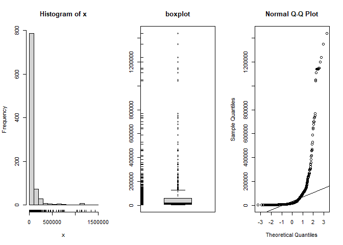<!-- -->

``` r
simple.eda(clean_colony$colony_max)
```

<!-- -->

``` r
simple.eda(clean_colony$colony_lost)
```

<!-- -->

``` r
simple.eda(clean_colony$colony_lost_pct)
```

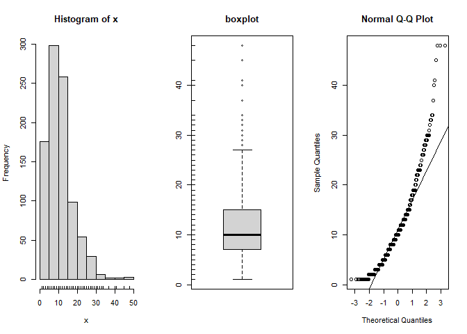<!-- -->

The graphs look pretty ugly for each of the four variables. The graphs
for the colonies lost (colony_lost) is better than the others, but it
still is very skewed at the right end. These show that the data is not
normally distributed at all.

You should try the simple.eda for other remaining numeric variables and
find out whether they are normally distributed or not:

Well, one other way to check whether the data is normally distributed or
not is by conducting a Shapiro test. It’s a good way to test for
normality before conducting other statistical tests.

``` r
shapiro.test(clean_colony$colony_n)
```

    ## 
    ##  Shapiro-Wilk normality test
    ## 
    ## data:  clean_colony$colony_n
    ## W = 0.398, p-value < 2.2e-16

The p-value is below 0.05, which suggests that the data is nor normally
distributed. Generally, a low p-value tells you it is unlikely the
results seen are due to chance. In this case, the hypothesis tested is
that the data is NOT normal, therefore a p-value below 0.05 means there
is a 95% confidence that the data is not normal.

``` r
shapiro.test(clean_colony$colony_lost)
```

    ## 
    ##  Shapiro-Wilk normality test
    ## 
    ## data:  clean_colony$colony_lost
    ## W = 0.35265, p-value < 2.2e-16

It’s the same for colonies lost too.

We want you to check the same tests for other numerical variables too.

# Log transformation of the data

Since the graphs generated from the simlple.eda were very boring and not
justifiable enough. We can log transform them for better visualization
and analysis. We use the log10 function for that.

We can use the mutate() function for that. The mutate() function exists
to compute transformations of variables in a data frame.

``` r
clean_colony <- clean_colony |> 
  mutate(clean_colony, log.colony_n = log10(colony_n), log.colony_max = log10(colony_max)) #using the mutate function to incorporate the log value to the number of colonies and the maximum colonies to transform them
summary(clean_colony) #checking the summary after the log transformation allows you to observe/view the "log.colon_n" and "log.colony_max" as new columns in the dataframe.
```

    ##    year                  months               state        colony_n      
    ##  2015:153   April-June      :273   California    : 25   Min.   :   1600  
    ##  2016:124   January-March   :216   Florida       : 25   1st Qu.:   8000  
    ##  2017:157   July-September  :265   Oregon        : 25   Median :  17500  
    ##  2018:157   October-December:175   Georgia       : 24   Mean   :  70448  
    ##  2019:108                          Ohio          : 24   3rd Qu.:  57000  
    ##  2020:152                          South Carolina: 24   Max.   :1440000  
    ##  2021: 78                          (Other)       :782                    
    ##    colony_max       colony_lost     colony_lost_pct  colony_added   
    ##  Min.   :   1900   Min.   :    30   Min.   : 1.00   Min.   :    10  
    ##  1st Qu.:   9500   1st Qu.:  1000   1st Qu.: 7.00   1st Qu.:   570  
    ##  Median :  22000   Median :  2200   Median :10.00   Median :  2100  
    ##  Mean   :  88477   Mean   :  9646   Mean   :11.46   Mean   : 10329  
    ##  3rd Qu.:  78000   3rd Qu.:  7000   3rd Qu.:15.00   3rd Qu.:  7500  
    ##  Max.   :1710000   Max.   :255000   Max.   :48.00   Max.   :250000  
    ##                                                                     
    ##   colony_reno     colony_reno_pct   log.colony_n   log.colony_max 
    ##  Min.   :    20   Min.   : 1.000   Min.   :3.204   Min.   :3.279  
    ##  1st Qu.:   420   1st Qu.: 2.000   1st Qu.:3.903   1st Qu.:3.978  
    ##  Median :  1300   Median : 6.000   Median :4.243   Median :4.342  
    ##  Mean   :  8952   Mean   : 9.075   Mean   :4.372   Mean   :4.461  
    ##  3rd Qu.:  5000   3rd Qu.:12.000   3rd Qu.:4.756   3rd Qu.:4.892  
    ##  Max.   :285000   Max.   :77.000   Max.   :6.158   Max.   :6.233  
    ## 

You could use the variables one by one in the above code, or all the
variables that needs to be log transformed together in a single code
using the coma(,) to separate the variables like shown above.

For practice, you can either add the formulas for remaining variables in
the chunk provided above or just write them again below:

Make sure to check the summary again to ensure that the new log
transformations are successful.

Now that we have log transformed the data, we want you to conduct the
exploratory analysis again to see if you notice any difference after the
log transformation. We have done one for you using the colony_n
variable.

``` r
simple.eda(clean_colony$log.colony_n)
```

<!-- -->

``` r
simple.eda(clean_colony$log.colony_max)
```

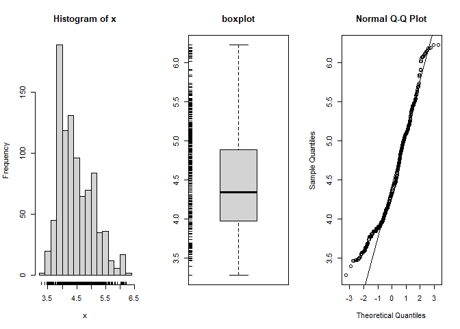<!-- -->

As you can see that the graphs have incredibly improved after the log
transformation for both the variables. We want to check using the
Shapiro test again to make sure the transformation was successful.

``` r
shapiro.test(clean_colony$log.colony_n)
```

    ## 
    ##  Shapiro-Wilk normality test
    ## 
    ## data:  clean_colony$log.colony_n
    ## W = 0.95174, p-value < 2.2e-16

``` r
shapiro.test(clean_colony$log.colony_max)
```

    ## 
    ##  Shapiro-Wilk normality test
    ## 
    ## data:  clean_colony$log.colony_max
    ## W = 0.94898, p-value < 2.2e-16

Well, surprisingly, the Shapiro test still yields undesired result.The
p-value must have been greater than 0.05 to provide 95% confidence that
the data is normally distributed. Since it’s a very large dataset and we
have performed other statistical tests down below, this does not really
matter.

However, we still want you to see if the log transformations helped the
other numeric variables.

Try running Shapiro tests for them too:

Do you see any significant difference between the old and the new
graphs? Do the new ones look more normally distributed? What about the
p-value in the Shapiro test?

### Visualizing relationship between two or more variables

In order to really understand your data and the relationship between
factors, it is important to be able to visualize them!

R studio has some built-in plotting functions in the base, but most
people seem to agree that using a package called ggplot2 is highly
superior. We already loaded this in at the beginning of the tutorial.

ggplot uses a funny style of code where you can use + to add more layers
and edit your graphs. The order you use might be a bit different from
what you’ve done before but you’ll get used to it!

Let’s say we are interested in if there’s a specific state where many
bee colonies are lost. Let’s try to make a graph of colonies lost per
state using the function ggplot(). I will include a lot of space when I
add a new term to the ggplot function so it’s easy to read, but when
you’re actually coding you’d want to keep these compact!

``` r
ggplot(clean_colony)+  #The name of the data frame you are using goes in the parenthesis
  
  
  
  aes(x=state, y=log((colony_lost)))+ #aes sets the x and y axes. Because there are big differences between states, I am using log to transform the colony lost function and make the states more comparable.
  
  
  
  geom_boxplot() #using geom_*** specifies which type of graph you want 
```

<!-- -->

We’ve got a graph, but it looks pretty scary!!The axis titles are ugly,
it’s impossible to read the state names, and the grid background is
distracting.

We can fix some of these problems.

``` r
ggplot(clean_colony)+  
  aes(x=state, y=log((colony_lost)))+
  geom_boxplot(width = .7)+
  
  
  
  coord_flip()+ #this is an easy way to switch the x and y axis so labels easier to read
  
  
  xlab("State") + #this fixes the labels so they say what we want
  ylab("Colonies Lost/Year")+
  
  
  
  theme_classic(base_size = 9)+ # this removes the annoying grid in the background
  
  
  
  geom_jitter(alpha=.1) #you can choose to show all the data points underlying the boxplot with this function. It's often a good idea to be transparent with your data so this is often a good idea, but in this case I felt it just made the graph look messy, even when I used alpha to make them transparant. 
```

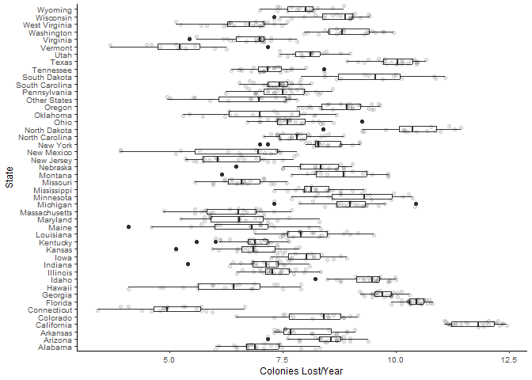<!-- -->

However, this is still pretty hard to read, since there are so many
states. While it makes sense initially to arrange them alphabetically,
it might be better to range them in order of their medians. We can add
use reorder() in the aes command to choose the order of our states.

``` r
ggplot(clean_colony)+  
  aes(x=reorder(state,colony_lost), y=log((colony_lost)), fill=state)+ #you can also add in color to make this a bit more lively. This will give a different color for each category
  
  geom_boxplot(width = .7, show.legend=FALSE)+ #however, for this specific graph, having a legend is redundant so we can remove it like this
  
  coord_flip()+ 
  xlab("State") +
  ylab("Colonies Lost")+
  theme_classic(base_size = 9)
```

<!-- -->

We can see that there is a range of loss across states, with New England
having some of the smallest losses while states like California and
North Dakota have a lot. We also have to remember that we used a log
transformation on the losses to make them more readable. If we remove
this transformation, the amount of loss in California appears all the
more dramatic.

``` r
ggplot(clean_colony)+  
  aes(x=reorder(state,colony_lost), y=(colony_lost), fill=state)+
  geom_boxplot(width = .7, show.legend=FALSE)+
  coord_flip()+ 
  xlab("State") +
  ylab("Colonies Lost")+
  theme_classic(base_size = 9)
```

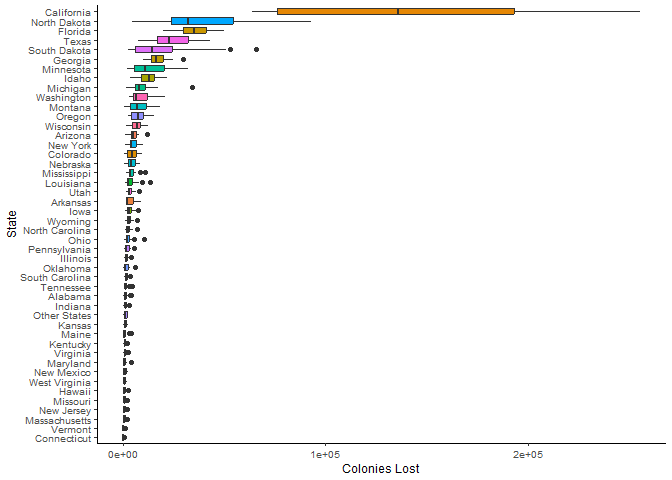<!-- -->

However, the number of colonies lost may not be the best metric of which
states are actually the most affected, since some states may simply have
larger bee populations to start with and thus greater numbers of loss
even if a small percentage is hurt.

To fix this, we can look at the colony_lost_pct, which gives the loss as
a percentage.

Create a boxplot like the ones above with states and percentages
lost.You may see that the results vary a lot!

Try graphs both with and without log transformation and feel free to
play around with stylizations.

When making a graph with ggplot2, it is important that you take a minute
to think about what graph type is best for your data. For example, you
can technically make a scatterplot using geom_point using the colony
lost and state information.

``` r
ggplot(clean_colony)+  
  aes(x=reorder(state,colony_lost), y=log((colony_lost)))+ 
  geom_point(show.legend=FALSE)+ 
  coord_flip()+ 
  xlab("State") +
  ylab("Colonies Lost")+
  theme_classic(base_size = 9)
```

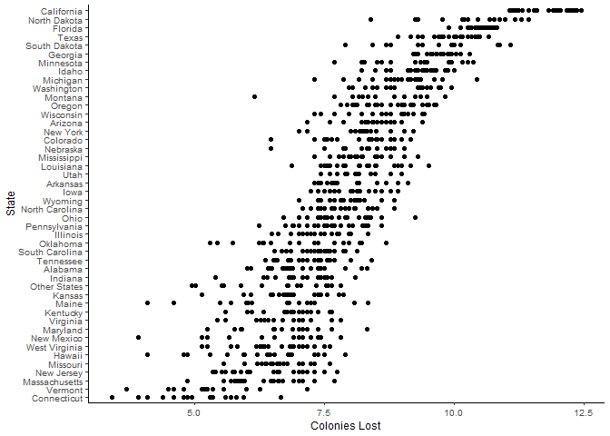<!-- -->

However, it’s pretty nightmarish to try to read, and though we can still
get a general idea of the trends it overall gives less information than
the boxplot. If you’re not sure about what kind of plot is best for your
data, think about whether you have categorical or numerical variables,
and if they are continuous. There are lots of cheatsheets and articles
available online if you’re not sure.

A scatterplot is most appropriate for two continuous (numerical)
variables. For example, we could plot colonies lost vs colonies added,
splitting by year.

The RColorBrewer package is just a nice way to get specific color
palettes if you want your graphs to look prettier.

You can view all the palettes here:
<https://r-graph-gallery.com/38-rcolorbrewers-palettes.html>

``` r
if (!require("RColorBrewer")) install.packages("RColorBrewer"); library(RColorBrewer)
```

    ## Loading required package: RColorBrewer

``` r
ggplot(clean_colony)+  # the general formatting is very similar to making the barplot
  aes(x=log(colony_lost), y=log(colony_added), color=year)+ 
  geom_point()+ #use geom_point to create a scatterplot
  xlab("Colonies Lost") +
  ylab("Colonies Added")+
  theme_classic()+
  scale_color_brewer(palette="OrRd") #this calls in colorbrewer and tells it I want to use the OrRd palatte
```

<!-- -->

From this, we can see that the relationship is mostly linear–as more
colonies are lost, more are added as well. However, there is also a
pretty large “hump” hanging down below the 5.0 y-axis, suggesting there
are places with pretty significant colony loss that don’t add in new
colonies. We can also see a small trend with the points from 2021
tending to be higher, suggesting that perhaps beekeepers are mobilizing
to add more new colonies.

We can further test this trend by adding linear models for each year
using geom_smooth. (Of course, you would want to be sure using a linear
model is appropriate. We will assume it is for here.) You will want to
include the argument “method=”lm”” to tell it to use a linear model.
Otherwise, it’ll try to fit the with kinda funky, not-so-great to
interpret curvy line. Se=false gets rid of messy error bars, though you
may want these in some cases to show how good the fit is.

``` r
ggplot(clean_colony)+  
  aes(x=log(colony_lost), y=log(colony_added), color=year)+ 
  geom_point()+ 
  xlab("Colonies Lost") +
  ylab("Colonies Added")+
  theme_classic()+
  scale_color_brewer(palette="OrRd")+
  geom_smooth(method="lm",se=FALSE)
```

    ## `geom_smooth()` using formula = 'y ~ x'

<!-- -->

The y-intercept for 2021 is highest, suggesting a greater number of
colonies is being added compared to those being lost.

Now try to make a scatterplot comparing colony percentage lost to
percentage renovated and split it by year.

\##Hypothesis Testing

Although the graphs we made are helpful to develop some initial trends
and see our data, it’s impossible to tell whether any trends we see are
actually significant or could be due to chance.

Since we are looking at data collected from the real world and not an
experiment, we can’t really suggest causation, but we can test for
correlations between factors.

An easy way to test correlation is to use a linear model. We can start
by looking at if the percentage lost varies by year.

We hypothesize that the percentage lost will increase by year, with
newer years like 2021 being significantly higher than years like 2016.

``` r
lmbee<-glm(colony_lost_pct~year, data=clean_colony)
summary(lmbee)
```

    ## 
    ## Call:
    ## glm(formula = colony_lost_pct ~ year, data = clean_colony)
    ## 
    ## Coefficients:
    ##             Estimate Std. Error t value Pr(>|t|)    
    ## (Intercept) 12.25490    0.56872  21.548   <2e-16 ***
    ## year2016    -0.57748    0.85001  -0.679   0.4971    
    ## year2017    -1.05745    0.79915  -1.323   0.1861    
    ## year2018    -0.19758    0.79915  -0.247   0.8048    
    ## year2019    -0.01416    0.88411  -0.016   0.9872    
    ## year2020    -1.99174    0.80561  -2.472   0.0136 *  
    ## year2021    -2.07541    0.97871  -2.121   0.0342 *  
    ## ---
    ## Signif. codes:  0 '***' 0.001 '**' 0.01 '*' 0.05 '.' 0.1 ' ' 1
    ## 
    ## (Dispersion parameter for gaussian family taken to be 49.48614)
    ## 
    ##     Null deviance: 46207  on 928  degrees of freedom
    ## Residual deviance: 45626  on 922  degrees of freedom
    ## AIC: 6270
    ## 
    ## Number of Fisher Scoring iterations: 2

Before continuing with interpretation, however, we should test that
using a linear model is appropriate for this data and fits well. To do
this, we can look at the qqplot, which shows the distance of the
residuals from a common line.

``` r
plot(lmbee)
```

<!-- -->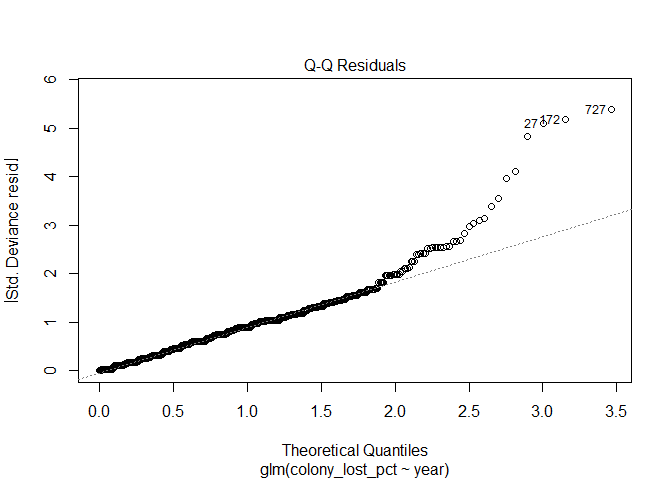<!-- --><!-- -->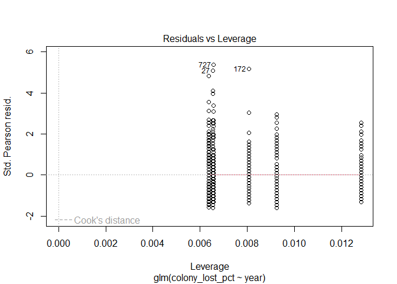<!-- -->
In a well-fitting model, the points should fall on the plotted line.
Some variation is to be expected, though, it may be helpful to do a log
transformation on the loss percentage variable.

``` r
lmbeelog<-glm(log(colony_lost_pct)~year, data=clean_colony)
summary(lmbeelog)
```

    ## 
    ## Call:
    ## glm(formula = log(colony_lost_pct) ~ year, data = clean_colony)
    ## 
    ## Coefficients:
    ##              Estimate Std. Error t value Pr(>|t|)    
    ## (Intercept)  2.299088   0.055952  41.090   <2e-16 ***
    ## year2016     0.003952   0.083626   0.047   0.9623    
    ## year2017    -0.132689   0.078622  -1.688   0.0918 .  
    ## year2018     0.001867   0.078622   0.024   0.9811    
    ## year2019     0.035979   0.086981   0.414   0.6792    
    ## year2020    -0.167824   0.079258  -2.117   0.0345 *  
    ## year2021    -0.239768   0.096288  -2.490   0.0129 *  
    ## ---
    ## Signif. codes:  0 '***' 0.001 '**' 0.01 '*' 0.05 '.' 0.1 ' ' 1
    ## 
    ## (Dispersion parameter for gaussian family taken to be 0.4789838)
    ## 
    ##     Null deviance: 449.37  on 928  degrees of freedom
    ## Residual deviance: 441.62  on 922  degrees of freedom
    ## AIC: 1961.5
    ## 
    ## Number of Fisher Scoring iterations: 2

``` r
plot(lmbeelog)
```

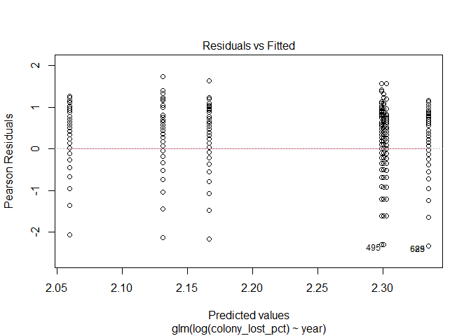<!-- -->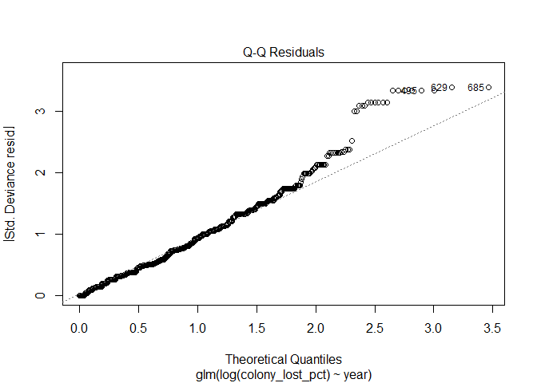<!-- -->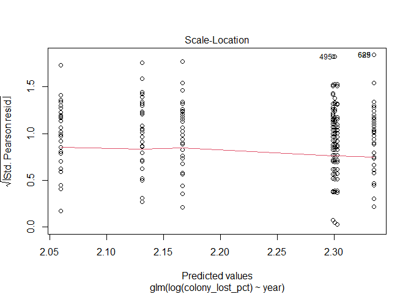<!-- --><!-- -->

We can see that this improves the deviating upper tail a bit.

Now that we know that using a linear model is OK, we can look to
interpret the model further. While the summary function spits out some
p-values, these can be inaccurate as they don’t account for error from
repeating tests over many categories.

Doing an Anova can provide more accurate p-values. In this case, the
p-value represents the chance that null hypothesis is true. In the
anova, the null hypothesis is that there is NOT a difference between the
distribution of two groups. So, when we have a low p-value, it means
that there is a very low chance that the two groups have the same
distribution and thus they are different!

``` r
anova(lmbeelog)
```

    ## Analysis of Deviance Table
    ## 
    ## Model: gaussian, link: identity
    ## 
    ## Response: log(colony_lost_pct)
    ## 
    ## Terms added sequentially (first to last)
    ## 
    ## 
    ##      Df Deviance Resid. Df Resid. Dev     F  Pr(>F)  
    ## NULL                   928     449.37                
    ## year  6    7.748       922     441.62 2.696 0.01338 *
    ## ---
    ## Signif. codes:  0 '***' 0.001 '**' 0.01 '*' 0.05 '.' 0.1 ' ' 1

The significant p-value tells us that at least one group is
significantly different from Arizona. We can follow this up with a tukey
test, which will tell us exactly which groups are different.

``` r
if (!require("multcomp")) install.packages("multcomp"); library(multcomp)
```

    ## Loading required package: multcomp

    ## Loading required package: mvtnorm

    ## Loading required package: survival

    ## 
    ## Attaching package: 'survival'

    ## The following object is masked from 'package:UsingR':
    ## 
    ##     cancer

    ## Loading required package: TH.data

    ## 
    ## Attaching package: 'TH.data'

    ## The following object is masked from 'package:MASS':
    ## 
    ##     geyser

``` r
tukey<-glht(lmbeelog, linfct=mcp(year="Tukey"))
summary(tukey)
```

    ## Warning in RET$pfunction("adjusted", ...): Completion with error > abseps

    ## 
    ##   Simultaneous Tests for General Linear Hypotheses
    ## 
    ## Multiple Comparisons of Means: Tukey Contrasts
    ## 
    ## 
    ## Fit: glm(formula = log(colony_lost_pct) ~ year, data = clean_colony)
    ## 
    ## Linear Hypotheses:
    ##                   Estimate Std. Error z value Pr(>|z|)
    ## 2016 - 2015 == 0  0.003952   0.083626   0.047    1.000
    ## 2017 - 2015 == 0 -0.132689   0.078622  -1.688    0.622
    ## 2018 - 2015 == 0  0.001867   0.078622   0.024    1.000
    ## 2019 - 2015 == 0  0.035979   0.086981   0.414    1.000
    ## 2020 - 2015 == 0 -0.167824   0.079258  -2.117    0.339
    ## 2021 - 2015 == 0 -0.239768   0.096288  -2.490    0.161
    ## 2017 - 2016 == 0 -0.136641   0.083148  -1.643    0.651
    ## 2018 - 2016 == 0 -0.002085   0.083148  -0.025    1.000
    ## 2019 - 2016 == 0  0.032027   0.091092   0.352    1.000
    ## 2020 - 2016 == 0 -0.171776   0.083750  -2.051    0.379
    ## 2021 - 2016 == 0 -0.243720   0.100018  -2.437    0.181
    ## 2018 - 2017 == 0  0.134556   0.078113   1.723    0.598
    ## 2019 - 2017 == 0  0.168668   0.086521   1.949    0.444
    ## 2020 - 2017 == 0 -0.035135   0.078753  -0.446    0.999
    ## 2021 - 2017 == 0 -0.107079   0.095873  -1.117    0.922
    ## 2019 - 2018 == 0  0.034112   0.086521   0.394    1.000
    ## 2020 - 2018 == 0 -0.169691   0.078753  -2.155    0.318
    ## 2021 - 2018 == 0 -0.241635   0.095873  -2.520    0.150
    ## 2020 - 2019 == 0 -0.203803   0.087099  -2.340    0.222
    ## 2021 - 2019 == 0 -0.275747   0.102839  -2.681    0.102
    ## 2021 - 2020 == 0 -0.071944   0.096395  -0.746    0.989
    ## (Adjusted p values reported -- single-step method)

Unfortunately, it appears that when p-values are adjusted to account for
multiple comparisons, none of the years are significantly different.
However, we can also improve the linear model by adding addition
explanatory variables, such as the state and months.

Different states could have difference beekeeping policies, climates,
and environmental stressors, meaning that state could effect the
percentages of bees lost. Similarly, different months have different
climates, which could also be a factor in colony loss.

``` r
lmbeenew<-glm(log(colony_lost_pct)~year + state + months, data=clean_colony)
summary(lmbeenew)
```

    ## 
    ## Call:
    ## glm(formula = log(colony_lost_pct) ~ year + state + months, data = clean_colony)
    ## 
    ## Coefficients:
    ##                         Estimate Std. Error t value Pr(>|t|)    
    ## (Intercept)             2.283424   0.126187  18.096  < 2e-16 ***
    ## year2016                0.039559   0.067179   0.589 0.556108    
    ## year2017               -0.128003   0.063328  -2.021 0.043556 *  
    ## year2018                0.004269   0.063139   0.068 0.946110    
    ## year2019               -0.117714   0.071211  -1.653 0.098684 .  
    ## year2020               -0.166205   0.063755  -2.607 0.009291 ** 
    ## year2021               -0.091855   0.079176  -1.160 0.246308    
    ## stateArizona            0.179633   0.165253   1.087 0.277328    
    ## stateArkansas           0.029910   0.169283   0.177 0.859796    
    ## stateCalifornia        -0.276596   0.159977  -1.729 0.084167 .  
    ## stateColorado           0.039099   0.177204   0.221 0.825422    
    ## stateConnecticut       -1.054252   0.174340  -6.047 2.18e-09 ***
    ## stateFlorida           -0.083638   0.159977  -0.523 0.601238    
    ## stateGeorgia           -0.081689   0.161532  -0.506 0.613184    
    ## stateHawaii            -1.363628   0.169355  -8.052 2.66e-15 ***
    ## stateIdaho             -0.369112   0.163267  -2.261 0.024018 *  
    ## stateIllinois          -0.026690   0.165111  -0.162 0.871618    
    ## stateIndiana           -0.261651   0.169353  -1.545 0.122707    
    ## stateIowa              -0.303111   0.174403  -1.738 0.082565 .  
    ## stateKansas             0.131145   0.169332   0.774 0.438854    
    ## stateKentucky          -0.170321   0.165196  -1.031 0.302813    
    ## stateLouisiana         -0.767256   0.163279  -4.699 3.04e-06 ***
    ## stateMaine             -0.699594   0.177346  -3.945 8.63e-05 ***
    ## stateMaryland          -0.396954   0.174370  -2.277 0.023057 *  
    ## stateMassachusetts     -0.440196   0.163265  -2.696 0.007148 ** 
    ## stateMichigan          -0.363864   0.169422  -2.148 0.032013 *  
    ## stateMinnesota         -0.337683   0.180456  -1.871 0.061640 .  
    ## stateMississippi       -0.397871   0.171682  -2.317 0.020707 *  
    ## stateMissouri          -0.530658   0.167145  -3.175 0.001552 ** 
    ## stateMontana           -0.941784   0.177263  -5.313 1.37e-07 ***
    ## stateNebraska          -0.479998   0.180618  -2.658 0.008015 ** 
    ## stateNew Jersey        -1.198856   0.167118  -7.174 1.56e-12 ***
    ## stateNew Mexico        -0.276535   0.180546  -1.532 0.125968    
    ## stateNew York          -0.376415   0.167137  -2.252 0.024562 *  
    ## stateNorth Carolina    -0.222886   0.163247  -1.365 0.172503    
    ## stateNorth Dakota      -0.602118   0.180724  -3.332 0.000899 ***
    ## stateOhio              -0.102985   0.161599  -0.637 0.524105    
    ## stateOklahoma          -0.510146   0.177217  -2.879 0.004091 ** 
    ## stateOregon            -0.754003   0.159977  -4.713 2.84e-06 ***
    ## stateOther States      -0.365691   0.171737  -2.129 0.033503 *  
    ## statePennsylvania      -0.424578   0.163347  -2.599 0.009500 ** 
    ## stateSouth Carolina    -0.338299   0.161567  -2.094 0.036560 *  
    ## stateSouth Dakota      -0.468438   0.188094  -2.490 0.012943 *  
    ## stateTennessee         -0.051476   0.161532  -0.319 0.750050    
    ## stateTexas             -0.502613   0.163247  -3.079 0.002143 ** 
    ## stateUtah              -0.047649   0.187938  -0.254 0.799913    
    ## stateVermont           -1.411767   0.197648  -7.143 1.93e-12 ***
    ## stateVirginia          -0.164105   0.163247  -1.005 0.315055    
    ## stateWashington        -0.572377   0.169284  -3.381 0.000754 ***
    ## stateWest Virginia     -0.350203   0.161570  -2.167 0.030466 *  
    ## stateWisconsin         -0.194841   0.169355  -1.150 0.250256    
    ## stateWyoming           -0.215110   0.177295  -1.213 0.225346    
    ## monthsJanuary-March     0.676535   0.051774  13.067  < 2e-16 ***
    ## monthsJuly-September    0.470339   0.050067   9.394  < 2e-16 ***
    ## monthsOctober-December  0.531867   0.056743   9.373  < 2e-16 ***
    ## ---
    ## Signif. codes:  0 '***' 0.001 '**' 0.01 '*' 0.05 '.' 0.1 ' ' 1
    ## 
    ## (Dispersion parameter for gaussian family taken to be 0.3063837)
    ## 
    ##     Null deviance: 449.37  on 928  degrees of freedom
    ## Residual deviance: 267.78  on 874  degrees of freedom
    ## AIC: 1592.8
    ## 
    ## Number of Fisher Scoring iterations: 2

``` r
plot(lmbeenew)
```

<!-- -->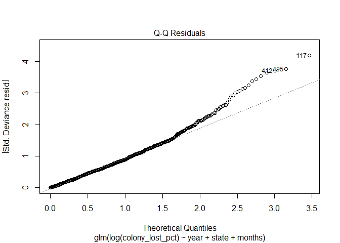<!-- -->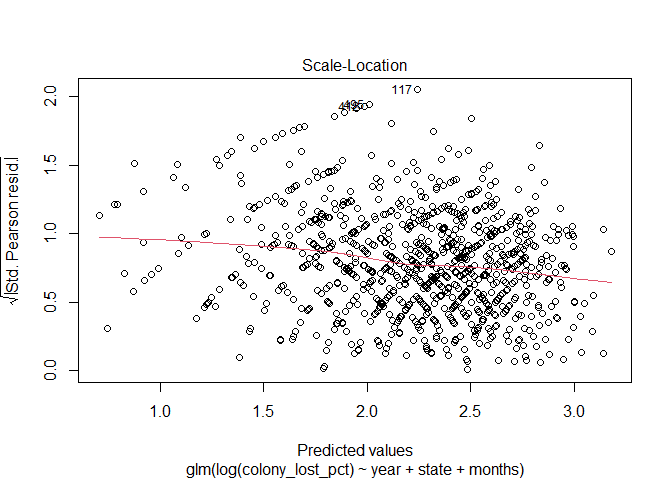<!-- -->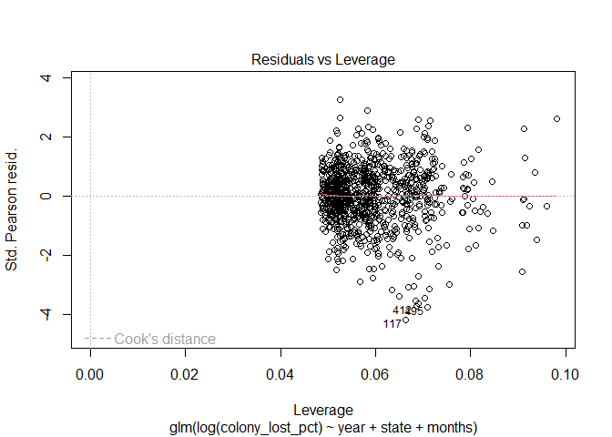<!-- -->

The qqplot seems ok in distribution.

``` r
anova(lmbeenew)
```

    ## Analysis of Deviance Table
    ## 
    ## Model: gaussian, link: identity
    ## 
    ## Response: log(colony_lost_pct)
    ## 
    ## Terms added sequentially (first to last)
    ## 
    ## 
    ##        Df Deviance Resid. Df Resid. Dev       F    Pr(>F)    
    ## NULL                     928     449.37                      
    ## year    6    7.748       922     441.62  4.2148 0.0003434 ***
    ## state  45  114.411       877     327.21  8.2983 < 2.2e-16 ***
    ## months  3   59.433       874     267.78 64.6604 < 2.2e-16 ***
    ## ---
    ## Signif. codes:  0 '***' 0.001 '**' 0.01 '*' 0.05 '.' 0.1 ' ' 1

``` r
tukey2<-glht(lmbeenew, linfct=mcp(year="Tukey"))
summary(tukey2)
```

    ## Warning in RET$pfunction("adjusted", ...): Completion with error > abseps
    ## Warning in RET$pfunction("adjusted", ...): Completion with error > abseps

    ## 
    ##   Simultaneous Tests for General Linear Hypotheses
    ## 
    ## Multiple Comparisons of Means: Tukey Contrasts
    ## 
    ## 
    ## Fit: glm(formula = log(colony_lost_pct) ~ year + state + months, data = clean_colony)
    ## 
    ## Linear Hypotheses:
    ##                   Estimate Std. Error z value Pr(>|z|)  
    ## 2016 - 2015 == 0  0.039559   0.067179   0.589   0.9971  
    ## 2017 - 2015 == 0 -0.128003   0.063328  -2.021   0.3969  
    ## 2018 - 2015 == 0  0.004269   0.063139   0.068   1.0000  
    ## 2019 - 2015 == 0 -0.117714   0.071211  -1.653   0.6439  
    ## 2020 - 2015 == 0 -0.166205   0.063755  -2.607   0.1218  
    ## 2021 - 2015 == 0 -0.091855   0.079176  -1.160   0.9075  
    ## 2017 - 2016 == 0 -0.167562   0.067150  -2.495   0.1585  
    ## 2018 - 2016 == 0 -0.035290   0.066953  -0.527   0.9984  
    ## 2019 - 2016 == 0 -0.157273   0.074955  -2.098   0.3501  
    ## 2020 - 2016 == 0 -0.205764   0.067508  -3.048   0.0362 *
    ## 2021 - 2016 == 0 -0.131414   0.082058  -1.601   0.6777  
    ## 2018 - 2017 == 0  0.132272   0.062728   2.109   0.3434  
    ## 2019 - 2017 == 0  0.010289   0.070433   0.146   1.0000  
    ## 2020 - 2017 == 0 -0.038202   0.063143  -0.605   0.9966  
    ## 2021 - 2017 == 0  0.036148   0.079688   0.454   0.9993  
    ## 2019 - 2018 == 0 -0.121983   0.070593  -1.728   0.5931  
    ## 2020 - 2018 == 0 -0.170474   0.063160  -2.699   0.0967 .
    ## 2021 - 2018 == 0 -0.096124   0.079201  -1.214   0.8873  
    ## 2020 - 2019 == 0 -0.048491   0.070901  -0.684   0.9934  
    ## 2021 - 2019 == 0  0.025859   0.087936   0.294   0.9999  
    ## 2021 - 2020 == 0  0.074350   0.080006   0.929   0.9673  
    ## ---
    ## Signif. codes:  0 '***' 0.001 '**' 0.01 '*' 0.05 '.' 0.1 ' ' 1
    ## (Adjusted p values reported -- single-step method)

Using a more complex model that accounts for state and month, there
appears to be a significant difference between 2020 and 2016.

If we combine our early filtering skills with our plotting skills, we
can see if 2020 is actually higher liked we hyposizd earlier.

``` r
twoyears<-filter(clean_colony, year=="2016" | year=="2020")
ggplot(twoyears)+  
  aes(x=year, y=log(colony_lost))+ 
  geom_boxplot()+
  xlab("State") +
  ylab("Colonies Lost")+
  theme_classic()
```

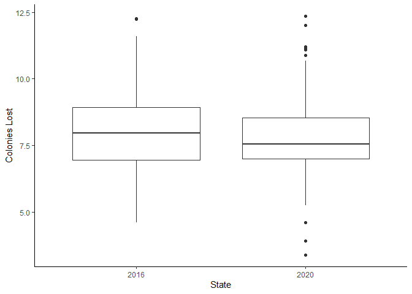<!-- -->

In fact, our earlier hyopothesis is not supported and it appears the
percentage of colonies lost is actually LOWER in 2020.

Now, try to use a linear model and anova to test whether the max colony
amount correlates with year. You may want to include state as an
additional explanatory variable.

Be sure to set your cutoff p-value before running the tests. R
automatically uses 0.05, but you may interested in a different cutoff.

If significance is found, follow up with a tukey test.

Thank you for following the tutorial! I hoped you learned something new!

*Acknowledgements*

Kai worked on the data filtering section, Sweta wrote the initial data
analysis, NA removal, simple.eda, log transformation and Shapiro tests,
and Victoria did the visualization and linear modeling sections.
